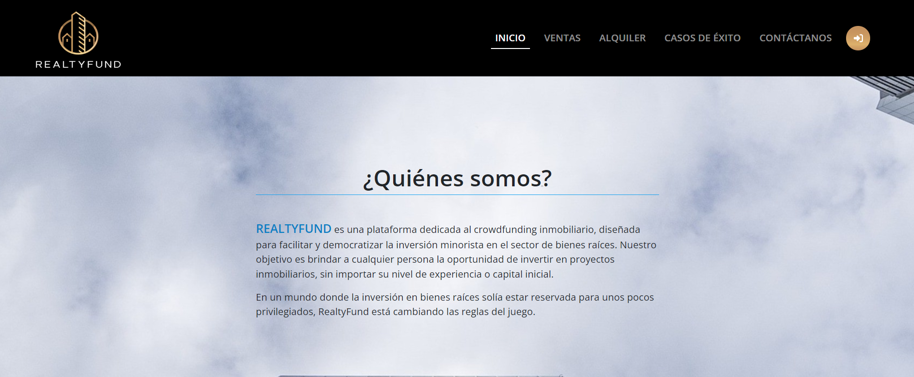
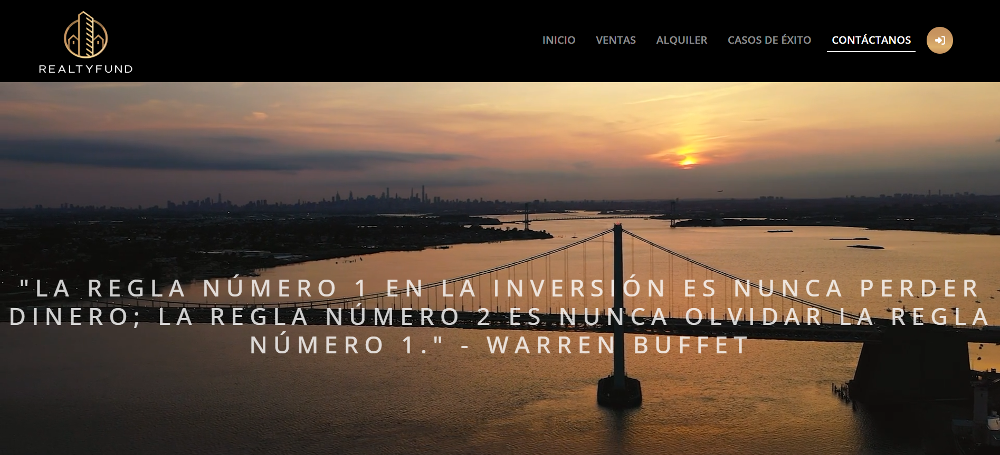

# RealtyFund 
***

# Descripción
RealtyFund es una aplicación web dedicada a la inversión en bienes raíces tokenizados. Este proyecto también sirve como un Proyecto Final de Grado (PFG).

El proyecto consta principalmente de 6 páginas más un modal. Se han desarrollado las API RESTful necesarias para cada solicitud al servidor, asegurando respuestas adecuadas y eficientes.

Para el backend, se ha utilizado Symfony v6.2, mientras que para el frontend se ha empleado Angular 17.

### Built with:

***

# Instalación
Para instalar la aplicación, sigue los siguientes pasos:
1. Clona el repositorio en tu máquina local tanto este como **[REPOSITORIO BACKEND (API)](https://github.com/magnumcrypto/RealtyFund-API-REST)**.
2. Abre una terminal y navega hasta la carpeta del proyecto.
3. Ejecuta el comando `composer install` para instalar las dependencias de Symfony.
4. Ejecuta el comando `npm install` para instalar las dependencias de Angular.
5. Crea una base de datos en MySQL con el nombre `taskmanagerdb` o bien modifica el archivo `.env` para que coincida con tu base de datos.
6. Ejecuta el comando `php bin/console doctrine:migrations:migrate` para crear las tablas en la base de datos.
7. Ejecuta el comando `aymfony server:start` para iniciar el servidor de Symfony.
8. Abre otra terminal y navega hasta la carpeta del proyecto frontend.
9. Ejecuta el comando `ng serve` para iniciar el servidor de Angular.
10. Abre un navegador y navega a `http://localhost:4200/` para ver la aplicación.
***
# Funcionalidades Principales
Registro y Autenticación: Permite a los usuarios crear cuentas, iniciar sesión y gestionar su perfil.

Exploración de Propiedades: Los usuarios pueden explorar diferentes propiedades tanto de alquiler y venta y también realizar filtrados sobre los inmuebles.

Inversiones: Funcionalidad para que los usuarios inviertan en propiedades mediante tokens.

***

# Contacto

